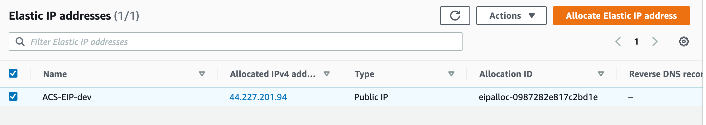

AUTOMATE INFRASTRUCTURE WITH IAC USING TERRAFORM. PART 2

This is the continuation of Project 16.

we continue by creating private subnet.

- The code below was inputed in the main.tf file in other for terraform to create private subnet.

```
resource "aws_subnet" "private" {
  count                   = var.preferred_number_of_private_subnets == null ? length(data.aws_availability_zones.available.names) : var.preferred_number_of_private_subnets
  vpc_id                  = aws_vpc.main.id
  cidr_block              = cidrsubnet(var.vpc_cidr, 8, count.index + 2)
  map_public_ip_on_launch = true
  availability_zone       = data.aws_availability_zones.available.names[count.index]

  tags = merge(
    var.tags,
    {
      Name = format("%s-PrivateSubnet-%s", var.name, count.index)
    },
  )
}
```

- Updated the variables.tf file with the code below.

```
variable "preferred_number_of_private_subnets" {
  type        = number
  description = "Number of private subnets"
}

variable "name" {
  type    = string
  default = "ACS"
}

variable "tags" {
  type        = map(string)
  description = "A mapping of tags to assign to all resources"
  default     = {}
}
```
- Entered the values below in terraform.tfvars file.

```
tags = {
  Owner-Email = "akinolatolulope24@gmail.com"
  Managed-By  = "Terraform"
}
```

n
Note since our vpc_cidr = "10.0.0.0/16", the newly created private cidr_blocks will be:

```
10.0.2.0/24
10.0.3.0/24
10.0.4.0/24
10.0.5.0/24
```

### Internet Gateway creation

- created a file in the working directory and named it internet-gw.tf

- populated the file with the code below

```
resource "aws_internet_gateway" "ig" {
  vpc_id = aws_vpc.main.id

  tags = merge(
    var.tags,
    {
      Name = format("%s-%s-%s!", var.name, aws_vpc.main.id, "IG")
    },
  )
}
```

Note Natgateway  depends on an Elastic Ip while Elastic IP depends on Internet Gateway.

therefore next we create internet gateway.

### NAT Gateway creation

- Created a file and named it nat-gw.tf  populated the file with the  code below.

```
resource "aws_eip" "nat_eip" {
  vpc        = true
  depends_on = [aws_internet_gateway.ig]

  tags = merge(
    var.tags,
    {
      Name = format("%s-EIP-%s", var.name, var.environment)
    },
  )
}

# Create Nat-Gateway
resource "aws_nat_gateway" "nat" {
  allocation_id = aws_eip.nat_eip.id
  subnet_id     = element(aws_subnet.public.*.id, 0)
  depends_on    = [aws_internet_gateway.ig]

  tags = merge(
    var.tags,
    {
      Name = format("%s-NAT-%s", var.name, var.environment)
    },
  )
}
```

therefore updated the variables.tf file with the command below

```
variable "environment" {
  type        = string
  description = "Environment"
}
```

also updated the terraform.tfvars file

```
environment = "DEV"
```

### Creating aws_route_table. aws_route  and aws_route_table_association

to createthe above resources, a file was created named routes.tf and was populated with the codes below.

```
# create private route table
resource "aws_route_table" "private-rtb" {
  vpc_id = aws_vpc.main.id

  tags = merge(
    var.tags,
    {
      Name = format("%s-PRIVATE-ROUTE-TABLE-%s", var.name, var.environment)
    },
  )
}

# create route table for the public subnets
resource "aws_route_table" "public-rtb" {
  vpc_id = aws_vpc.main.id

  tags = merge(
    var.tags,
    {
      Name = format("%s-PUBLIC-ROUTE-TABLE-%s", var.name, var.environment)
    },
  )
}

# associate all private subnets to the private route table
resource "aws_route_table_association" "private-subnets-assoc" {
  count          = length(aws_subnet.private[*].id)
  subnet_id      = element(aws_subnet.private[*].id, count.index)
  route_table_id = aws_route_table.private-rtb.id
}

# associate all public subnets to the public route table
resource "aws_route_table_association" "public-subnets-assoc" {
  count          = length(aws_subnet.public[*].id)
  subnet_id      = element(aws_subnet.public[*].id, count.index)
  route_table_id = aws_route_table.public-rtb.id
}

# create route for the private route table and attatch a nat gateway to it
resource "aws_route" "private-rtb-route" {
  route_table_id         = aws_route_table.private-rtb.id
  destination_cidr_block = "0.0.0.0/0"
  gateway_id             = aws_nat_gateway.nat.id
}


# create route for the public route table and attach the internet gateway
resource "aws_route" "public-rtb-route" {
  route_table_id         = aws_route_table.public-rtb.id
  destination_cidr_block = "0.0.0.0/0"
  gateway_id             = aws_internet_gateway.ig.id
}
```

thus,  run terraform plan to ensure there is no error in the code so far after which I run terraform apply --auto-approve. to create the resources.

Next.

### Creating certificate Manager

- created a file cert.tf and populated it with the command below.

```
# The entire section create a certiface, public zone, and validate the certificate using DNS method

# Create the certificate using a wildcard for all the domains created in tolulorpeh.fun
resource "aws_acm_certificate" "matthew" {
  domain_name       = "*.tolulorpeh.fun"
  validation_method = "DNS"
}

# calling the hosted zone
data "aws_route53_zone" "matthew" {
  name         = "tolulorpeh.fun"
  private_zone = false
}

# validate the certificate through DNS method
resource "aws_acm_certificate_validation" "matthew" {
  certificate_arn         = aws_acm_certificate.matthew.arn
  validation_record_fqdns = [for record in aws_route53_record.matthew : record.fqdn]
}

# selecting validation method
resource "aws_route53_record" "matthew" {
  for_each = {
    for dvo in aws_acm_certificate.michaeloajala.domain_validation_options : dvo.domain_name => {
      name   = dvo.resource_record_name
      record = dvo.resource_record_value
      type   = dvo.resource_record_type
    }
  }

  allow_overwrite = true
  name            = each.value.name
  records         = [each.value.record]
  ttl             = 60
  type            = each.value.type
  zone_id         = data.aws_route53_zone.matthew.zone_id
}


# create records for tooling
resource "aws_route53_record" "tooling" {
  zone_id = data.aws_route53_zone.matthew.zone_id
  name    = "tooling.tolulorpeh.fun"
  type    = "A"

  alias {
    name                   = aws_lb.ext-alb.dns_name
    zone_id                = aws_lb.ext-alb.zone_id
    evaluate_target_health = true
  }
}


# create records for wordpress
resource "aws_route53_record" "wordpress" {
  zone_id = data.aws_route53_zone.michaeloajala.zone_id
  name    = "wordpress.tolulorpeh.fun"
  type    = "A"

  alias {
    name                   = aws_lb.ext-alb.dns_name
    zone_id                = aws_lb.ext-alb.zone_id
    evaluate_target_health = true
  }
}
```

### Creating Security Group

- Createda file and named it security.tf then populated it with  the code below.

```
# security group for alb, to allow acess from anywhere on port 80 & 443.
resource "aws_security_group" "ext-alb-sg" {
  name        = "ext-alb-sg"
  description = "Allow TLS inbound traffic"
  vpc_id      = aws_vpc.main.id

  ingress {
    description = "HTTPS"
    from_port   = 443
    to_port     = 443
    protocol    = "tcp"
    cidr_blocks = ["0.0.0.0/0"]
  }

  ingress {
    description = "HTTP"
    from_port   = 80
    to_port     = 80
    protocol    = "tcp"
    cidr_blocks = ["0.0.0.0/0"]
  }

  egress {
    from_port   = 0
    to_port     = 0
    protocol    = "-1"
    cidr_blocks = ["0.0.0.0/0"]
  }

  tags = {
    Name = "EXT-ALB-SG"
  }
}


# Security group for bastion to allow access into the bastion host from your IP
resource "aws_security_group" "bastion-sg" {
  name        = "bastion-sg"
  description = "Allow incoming HTTP connections."
  vpc_id      = aws_vpc.main.id

  ingress {
    description = "SSH"
    from_port   = 22
    to_port     = 22
    protocol    = "tcp"
    cidr_blocks = ["0.0.0.0/0"]
  }

  egress {
    from_port   = 0
    to_port     = 0
    protocol    = "-1"
    cidr_blocks = ["0.0.0.0/0"]
  }

  tags = {
    Name        = "BASTION-SG"
    Environment = var.environment
  }
}

# Security group for nginx reverse proxy to allow access only from the external load balancer and bastion instance 
resource "aws_security_group" "nginx-sg" {
  name   = "nginx-sg"
  vpc_id = aws_vpc.main.id

  egress {
    from_port   = 0
    to_port     = 0
    protocol    = "-1"
    cidr_blocks = ["0.0.0.0/0"]
  }

  tags = {
    Name = "NGINX-SG"
  }
}

resource "aws_security_group_rule" "inbound-nginx-https" {
  type                     = "ingress"
  from_port                = 443
  to_port                  = 443
  protocol                 = "tcp"
  source_security_group_id = aws_security_group.ext-alb-sg.id
  security_group_id        = aws_security_group.nginx-sg.id
}

resource "aws_security_group_rule" "inbound-nginx-http-80" {
  type                     = "ingress"
  from_port                = 80
  to_port                  = 80
  protocol                 = "tcp"
  source_security_group_id = aws_security_group.ext-alb-sg.id
  security_group_id        = aws_security_group.nginx-sg.id
}

resource "aws_security_group_rule" "inbound-bastion-ssh" {
  type                     = "ingress"
  from_port                = 22
  to_port                  = 22
  protocol                 = "tcp"
  source_security_group_id = aws_security_group.bastion-sg.id
  security_group_id        = aws_security_group.nginx-sg.id
}

# Security group for internal alb, to have access only from nginx reverse proxy server
resource "aws_security_group" "int-alb-sg" {
  name   = "int-alb-sg"
  vpc_id = aws_vpc.main.id

  egress {
    from_port   = 0
    to_port     = 0
    protocol    = "-1"
    cidr_blocks = ["0.0.0.0/0"]
  }

  tags = {
    Name = "INT-ALB-SG"
  }
}

resource "aws_security_group_rule" "inbound-ialb-https" {
  type                     = "ingress"
  from_port                = 443
  to_port                  = 443
  protocol                 = "tcp"
  source_security_group_id = aws_security_group.nginx-sg.id
  security_group_id        = aws_security_group.int-alb-sg.id
}

# Security group for webservers, to have access only from the internal load balancer and bastion instance
resource "aws_security_group" "webserver-sg" {
  name   = "webserver-sg"
  vpc_id = aws_vpc.main.id

  egress {
    from_port   = 0
    to_port     = 0
    protocol    = "-1"
    cidr_blocks = ["0.0.0.0/0"]
  }

  tags = {
    Name = "WEBSERVER-SG"
  }
}

resource "aws_security_group_rule" "inbound-webserver-https" {
  type                     = "ingress"
  from_port                = 443
  to_port                  = 443
  protocol                 = "tcp"
  source_security_group_id = aws_security_group.int-alb-sg.id
  security_group_id        = aws_security_group.webserver-sg.id
}

resource "aws_security_group_rule" "inbound-webserver-ssh" {
  type                     = "ingress"
  from_port                = 22
  to_port                  = 22
  protocol                 = "tcp"
  source_security_group_id = aws_security_group.bastion-sg.id
  security_group_id        = aws_security_group.webserver-sg.id
}

# Security group for datalayer to allow traffic from webserver on nfs and mysql port ann bastion host on mysql
resource "aws_security_group" "datalayer-sg" {
  name   = "datalayer-sg"
  vpc_id = aws_vpc.main.id

  egress {
    from_port   = 0
    to_port     = 0
    protocol    = "-1"
    cidr_blocks = ["0.0.0.0/0"]
  }

  tags = {
    Name = "DATALAYER-SG"
  }
}

resource "aws_security_group_rule" "inbound-nfs-port" {
  type                     = "ingress"
  from_port                = 2049
  to_port                  = 2049
  protocol                 = "tcp"
  source_security_group_id = aws_security_group.webserver-sg.id
  security_group_id        = aws_security_group.datalayer-sg.id
}

resource "aws_security_group_rule" "inbound-mysql-bastion" {
  type                     = "ingress"
  from_port                = 3306
  to_port                  = 3306
  protocol                 = "tcp"
  source_security_group_id = aws_security_group.bastion-sg.id
  security_group_id        = aws_security_group.datalayer-sg.id
}

resource "aws_security_group_rule" "inbound-mysql-webserver" {
  type                     = "ingress"
  from_port                = 3306
  to_port                  = 3306
  protocol                 = "tcp"
  source_security_group_id = aws_security_group.webserver-sg.id
  security_group_id        = aws_security_group.datalayer-sg.id
}
```

### Creating Load Balancer

- Created another file and named it alb.tf which was populated with the code below.

```
# ----------------------------
#External Load balancer for reverse proxy nginx
#---------------------------------

resource "aws_lb" "ext-alb" {
  name     = "ext-alb"
  internal = false
  security_groups = [
    aws_security_group.ext-alb-sg.id,
  ]

  subnets = [
    aws_subnet.public[0].id,
    aws_subnet.public[1].id
  ]

  tags = merge(
    var.tags,
    {
      Name = "ACS-ext-alb"
    },
  )

  ip_address_type    = "ipv4"
  load_balancer_type = "application"
}

#--- create a target group for the external load balancer
resource "aws_lb_target_group" "nginx-tgt" {
  health_check {
    interval            = 10
    path                = "/healthstatus"
    protocol            = "HTTPS"
    timeout             = 5
    healthy_threshold   = 5
    unhealthy_threshold = 2
  }
  name        = "nginx-tgt"
  port        = 443
  protocol    = "HTTPS"
  target_type = "instance"
  vpc_id      = aws_vpc.main.id
}

#--- create a listener for the load balancer

resource "aws_lb_listener" "nginx-listner" {
  load_balancer_arn = aws_lb.ext-alb.arn
  port              = 443
  protocol          = "HTTPS"
  certificate_arn   = aws_acm_certificate_validation.matthew.certificate_arn

  default_action {
    type             = "forward"
    target_group_arn = aws_lb_target_group.nginx-tgt.arn
  }
}


# ----------------------------
#Internal Load Balancers for webservers
#---------------------------------

resource "aws_lb" "ialb" {
  name     = "ialb"
  internal = true
  security_groups = [
    aws_security_group.int-alb-sg.id,
  ]

  subnets = [
    aws_subnet.private[0].id,
    aws_subnet.private[1].id
  ]

  tags = merge(
    var.tags,
    {
      Name = "ACS-int-alb"
    },
  )

  ip_address_type    = "ipv4"
  load_balancer_type = "application"
}


# --- target group  for wordpress -------

resource "aws_lb_target_group" "wordpress-tgt" {
  health_check {
    interval            = 10
    path                = "/healthstatus"
    protocol            = "HTTPS"
    timeout             = 5
    healthy_threshold   = 5
    unhealthy_threshold = 2
  }

  name        = "wordpress-tgt"
  port        = 443
  protocol    = "HTTPS"
  target_type = "instance"
  vpc_id      = aws_vpc.main.id
}


# --- target group for tooling -------

resource "aws_lb_target_group" "tooling-tgt" {
  health_check {
    interval            = 10
    path                = "/healthstatus"
    protocol            = "HTTPS"
    timeout             = 5
    healthy_threshold   = 5
    unhealthy_threshold = 2
  }

  name        = "michael-tooling-tgt"
  port        = 443
  protocol    = "HTTPS"
  target_type = "instance"
  vpc_id      = aws_vpc.main.id
}

# For this aspect a single listener was created for the wordpress which is default,
# A rule was created to route traffic to tooling when the host header changes


resource "aws_lb_listener" "web-listener" {
  load_balancer_arn = aws_lb.ialb.arn
  port              = 443
  protocol          = "HTTPS"
  certificate_arn   = aws_acm_certificate_validation.matthew.certificate_arn


  default_action {
    type             = "forward"
    target_group_arn = aws_lb_target_group.wordpress-tgt.arn
  }
}

# listener rule for tooling target

resource "aws_lb_listener_rule" "tooling-listener" {
  listener_arn = aws_lb_listener.web-listener.arn
  priority     = 99

  action {
    type             = "forward"
    target_group_arn = aws_lb_target_group.tooling-tgt.arn
  }

  condition {
    host_header {
      values = ["tooling.michaeloajala.tk"]
    }
  }
}
```

### Creating Rolesand Policies

- created a file and named it roles.tf then populated it with the code below.

```
resource "aws_iam_role" "ec2_instance_role" {
  name = "ec2_instance_role"
  assume_role_policy = jsonencode({
    Version = "2012-10-17"
    Statement = [
      {
        Action = "sts:AssumeRole"
        Effect = "Allow"
        Sid    = ""
        Principal = {
          Service = "ec2.amazonaws.com"
        }
      },
    ]
  })
  tags = merge(
    var.tags,
    {
      Name = "aws assume role"
    },
  )
}

resource "aws_iam_policy" "policy" {
  name        = "ec2_instance_policy"
  description = "A test policy"
  policy = jsonencode({
    Version = "2012-10-17"
    Statement = [
      {
        Action = [
          "ec2:Describe*",
        ]
        Effect   = "Allow"
        Resource = "*"
      },
    ]

  })

  tags = merge(
    var.tags,
    {
      Name = "aws assume policy"
    },
  )
}

resource "aws_iam_role_policy_attachment" "test-attach" {
  role       = aws_iam_role.ec2_instance_role.name
  policy_arn = aws_iam_policy.policy.arn
}

resource "aws_iam_instance_profile" "ip" {
  name = "aws_instance_profile_test"
  role = aws_iam_role.ec2_instance_role.name
}
```

### Creating Auto Scaling group for bastion and nginx

- created a file and named it asg-bastion-nginx.tf populated it with the code below.

```
# creating sns topic for all the auto scaling groups
resource "aws_sns_topic" "matthew-sns" {
  name = "Default_CloudWatch_Alarms_Topic"
}


# creating notification for all the auto scaling groups
resource "aws_autoscaling_notification" "david_notifications" {
  group_names = [
    aws_autoscaling_group.bastion-asg.name,
    aws_autoscaling_group.nginx-asg.name,
    aws_autoscaling_group.wordpress-asg.name,
    aws_autoscaling_group.tooling-asg.name,
  ]
  notifications = [
    "autoscaling:EC2_INSTANCE_LAUNCH",
    "autoscaling:EC2_INSTANCE_TERMINATE",
    "autoscaling:EC2_INSTANCE_LAUNCH_ERROR",
    "autoscaling:EC2_INSTANCE_TERMINATE_ERROR",
  ]

  topic_arn = aws_sns_topic.michael-sns.arn
}


resource "random_shuffle" "az_list" {
  input = data.aws_availability_zones.available.names
}


# launch template for bastion

resource "aws_launch_template" "bastion-launch-template" {
  image_id               = var.ami
  instance_type          = "t2.micro"
  vpc_security_group_ids = [aws_security_group.bastion-sg.id]

  iam_instance_profile {
    name = aws_iam_instance_profile.ip.id
  }

  key_name = var.keypair

  placement {
    availability_zone = "random_shuffle.az_list.result"
  }

  lifecycle {
    create_before_destroy = true
  }

  tag_specifications {
    resource_type = "instance"

    tags = merge(
      var.tags,
      {
        Name = "bastion-launch-template"
      },
    )
  }

  user_data = filebase64("${path.module}/bastion.sh")
}


# ---- Autoscaling for bastion  hosts


resource "aws_autoscaling_group" "bastion-asg" {
  name                      = "bastion-asg"
  max_size                  = 2
  min_size                  = 2
  health_check_grace_period = 300
  health_check_type         = "ELB"
  desired_capacity          = 2

  vpc_zone_identifier = [
    aws_subnet.public[0].id,
    aws_subnet.public[1].id
  ]


  launch_template {
    id      = aws_launch_template.bastion-launch-template.id
    version = "$Latest"
  }
  tag {
    key                 = "Name"
    value               = "ACS-bastion"
    propagate_at_launch = true
  }

}


# launch template for nginx

resource "aws_launch_template" "nginx-launch-template" {
  image_id               = var.ami
  instance_type          = "t2.micro"
  vpc_security_group_ids = [aws_security_group.nginx-sg.id]

  iam_instance_profile {
    name = aws_iam_instance_profile.ip.id
  }

  key_name = var.keypair

  placement {
    availability_zone = "random_shuffle.az_list.result"
  }

  lifecycle {
    create_before_destroy = true
  }

  tag_specifications {
    resource_type = "instance"

    tags = merge(
      var.tags,
      {
        Name = "nginx-launch-template"
      },
    )
  }

  user_data = filebase64("${path.module}/nginx.sh")
}


# ------ Autoscslaling group for reverse proxy nginx ---------

resource "aws_autoscaling_group" "nginx-asg" {
  name                      = "nginx-asg"
  max_size                  = 2
  min_size                  = 1
  health_check_grace_period = 300
  health_check_type         = "ELB"
  desired_capacity          = 1

  vpc_zone_identifier = [
    aws_subnet.public[0].id,
    aws_subnet.public[1].id
  ]

  launch_template {
    id      = aws_launch_template.nginx-launch-template.id
    version = "$Latest"
  }

  tag {
    key                 = "Name"
    value               = "ACS-nginx"
    propagate_at_launch = true
  }


}

# attaching autoscaling group of nginx to external load balancer
resource "aws_autoscaling_attachment" "asg_attachment_nginx" {
  autoscaling_group_name = aws_autoscaling_group.nginx-asg.id
  lb_target_group_arn    = aws_lb_target_group.nginx-tgt.arn
}
```

-  thus, updated the variables.tf file with the command below

```
variable "ami" {
  type        = string
  description = "AMI ID for the launch template"
}

variable "keypair" {
  type        = string
  description = "Key pair for the instances"
}

variable "account_no" {
  type        = number
  description = "the account number"
}
```

- Also updated the terraform.tfvars file with the command below.

```
ami = "ami-0fb653ca2d3203ac1"

keypair = "EC2 Tutorial"

```

- Created bastion.sh and nginx.sh and populate the files with their respective user data as seen below.

```
# bastion userdata
#!/bin/bash
yum install -y mysql
yum install -y git tmux
yum install -y ansible
```

```
#!/bin/bash
yum install -y nginx
systemctl start nginx
systemctl enable nginx
git clone https://github.com/matthew-akinola/ACS-project-config.git
mv /ACS-project-config/reverse.conf /etc/nginx/
mv /etc/nginx/nginx.conf /etc/nginx/nginx.conf-distro
cd /etc/nginx/
touch nginx.conf
sed -n 'w nginx.conf' reverse.conf
systemctl restart nginx
rm -rf reverse.conf
rm -rf /ACS-project-config
```

### Creating Auto Scaling group for wordpress and tooling.

- created a file and named it asg-webserver.tf and populated it with the code below

```
# launch template for wordpress

resource "aws_launch_template" "wordpress-launch-template" {
  image_id               = var.ami
  instance_type          = "t2.micro"
  vpc_security_group_ids = [aws_security_group.webserver-sg.id]

  iam_instance_profile {
    name = aws_iam_instance_profile.ip.id
  }

  key_name = var.keypair


  placement {
    availability_zone = "random_shuffle.az_list.result"
  }

  lifecycle {
    create_before_destroy = true
  }

  tag_specifications {
    resource_type = "instance"

    tags = merge(
      var.tags,
      {
        Name = "wordpress-launch-template"
      },
    )

  }

  user_data = filebase64("${path.module}/wordpress.sh")
}

# ---- Autoscaling for wordpress application

resource "aws_autoscaling_group" "wordpress-asg" {
  name                      = "wordpress-asg"
  max_size                  = 2
  min_size                  = 1
  health_check_grace_period = 300
  health_check_type         = "ELB"
  desired_capacity          = 1
  vpc_zone_identifier = [

    aws_subnet.private[0].id,
    aws_subnet.private[1].id
  ]


  launch_template {
    id      = aws_launch_template.wordpress-launch-template.id
    version = "$Latest"
  }
  tag {
    key                 = "Name"
    value               = "ACS-wordpress"
    propagate_at_launch = true
  }
}


# attaching autoscaling group of  wordpress application to internal loadbalancer
resource "aws_autoscaling_attachment" "asg_attachment_wordpress" {
  autoscaling_group_name = aws_autoscaling_group.wordpress-asg.id
  lb_target_group_arn    = aws_lb_target_group.wordpress-tgt.arn
}


# launch template for toooling
resource "aws_launch_template" "tooling-launch-template" {
  image_id               = var.ami
  instance_type          = "t2.micro"
  vpc_security_group_ids = [aws_security_group.webserver-sg.id]

  iam_instance_profile {
    name = aws_iam_instance_profile.ip.id
  }

  key_name = var.keypair


  placement {
    availability_zone = "random_shuffle.az_list.result"
  }

  lifecycle {
    create_before_destroy = true
  }

  tag_specifications {
    resource_type = "instance"

    tags = merge(
      var.tags,
      {
        Name = "tooling-launch-template"
      },
    )
  }

  user_data = filebase64("${path.module}/tooling.sh")
}


# ---- Autoscaling for tooling -----

resource "aws_autoscaling_group" "tooling-asg" {
  name                      = "tooling-asg"
  max_size                  = 2
  min_size                  = 1
  health_check_grace_period = 300
  health_check_type         = "ELB"
  desired_capacity          = 1

  vpc_zone_identifier = [

    aws_subnet.private[0].id,
    aws_subnet.private[1].id
  ]

  launch_template {
    id      = aws_launch_template.tooling-launch-template.id
    version = "$Latest"
  }

  tag {
    key                 = "Name"
    value               = "ACS-tooling"
    propagate_at_launch = true
  }
}

# attaching autoscaling group of  tooling application to internal loadbalancer
resource "aws_autoscaling_attachment" "asg_attachment_tooling" {
  autoscaling_group_name = aws_autoscaling_group.tooling-asg.id
  lb_target_group_arn   = aws_lb_target_group.tooling-tgt.arn
}
```

### Creating output for printing out value

- created a file output.tf and populated it with the command below.

```
output "alb_dns_name" {
  value       = aws_lb.ext-alb.dns_name
  description = "External load balance arn"
}
```

### Creating KMS key

- created a file and namedit efs.tf populated it with the code below.

```
# create key from key management system
resource "aws_kms_key" "ACS-kms" {
  description = "KMS key "
  policy      = <<EOF
  {
  "Version": "2012-10-17",
  "Id": "kms-key-policy",
  "Statement": [
    {
      "Sid": "Enable IAM User Permissions",
      "Effect": "Allow",
      "Principal": { "AWS": "arn:aws:iam::${var.account_no}:user/michael" },
      "Action": "kms:*",
      "Resource": "*"
    }
  ]
}
EOF
}

# create key alias
resource "aws_kms_alias" "alias" {
  name          = "alias/kms"
  target_key_id = aws_kms_key.ACS-kms.key_id
}

# create Elastic file system
resource "aws_efs_file_system" "ACS-efs" {
  encrypted  = true
  kms_key_id = aws_kms_key.ACS-kms.arn

  tags = merge(
    var.tags,
    {
      Name = "ACS-efs"
    },
  )
}


# set first mount target for the EFS 
resource "aws_efs_mount_target" "subnet-1" {
  file_system_id  = aws_efs_file_system.ACS-efs.id
  subnet_id       = aws_subnet.private[0].id
  security_groups = [aws_security_group.datalayer-sg.id]
}


# set second mount target for the EFS 
resource "aws_efs_mount_target" "subnet-2" {
  file_system_id  = aws_efs_file_system.ACS-efs.id
  subnet_id       = aws_subnet.private[1].id
  security_groups = [aws_security_group.datalayer-sg.id]
}


# create access point for wordpress
resource "aws_efs_access_point" "wordpress" {
  file_system_id = aws_efs_file_system.ACS-efs.id

  posix_user {
    gid = 0
    uid = 0
  }

  root_directory {
    path = "/wordpress"

    creation_info {
      owner_gid   = 0
      owner_uid   = 0
      permissions = 0755
    }

  }

}


# create access point for tooling
resource "aws_efs_access_point" "tooling" {
  file_system_id = aws_efs_file_system.ACS-efs.id
  posix_user {
    gid = 0
    uid = 0
  }

  root_directory {

    path = "/tooling"

    creation_info {
      owner_gid   = 0
      owner_uid   = 0
      permissions = 0755
    }

  }
}
```

- thus, Updated variable.tf with the command below.

```
variable "account_no" {
  type        = number
  description = "the account number"
}
```

- Also, updated terraform.tfvar, with the value below.

```
account_no = "839942615319"
```

### Creating RDS

- created a file called rds.tf and populated it with the code below.

```
# create DB subnet group from the private subnets
resource "aws_db_subnet_group" "ACS-rds" {
  name       = "acs-rds"
  subnet_ids = [aws_subnet.private[2].id, aws_subnet.private[3].id]

  tags = merge(
    var.tags,
    {
      Name = "ACS-rds"
    },
  )
}

# create the RDS instance with the subnets group
resource "aws_db_instance" "ACS-rds" {
  allocated_storage      = 20
  storage_type           = "gp2"
  engine                 = "mysql"
  engine_version         = "5.7"
  instance_class         = "db.t3.micro"
  db_name                = "michaeldb"
  username               = var.master-username
  password               = var.master-password
  parameter_group_name   = "default.mysql5.7"
  db_subnet_group_name   = aws_db_subnet_group.ACS-rds.name
  skip_final_snapshot    = true
  vpc_security_group_ids = [aws_security_group.datalayer-sg.id]
  multi_az               = "true"
}
```

- thus, updated the variable.tf file with the values below.

```
variable "master-username" {
  type        = string
  description = "RDS admin username"
}

variable "master-password" {
  type        = string
  description = "RDS master password"
}
```

- and also the terraform.tfvars file with the value below.

```
master-password = "matthew-akinola"

master-username = "matthew"
```

finally run terraform plan which shows there was no error then run terraform apply -auto-approve to create resources.

The images below shows that  all the resources were created succesfully.





